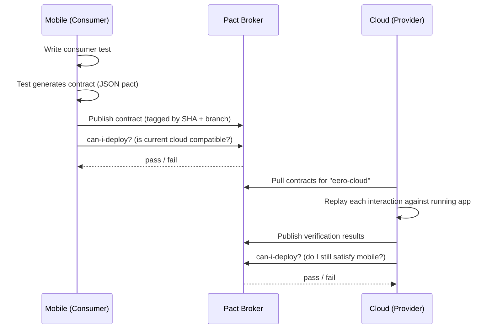
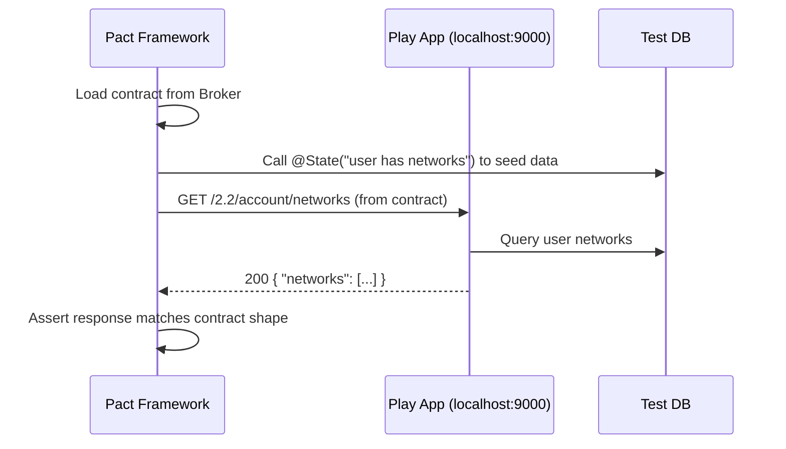
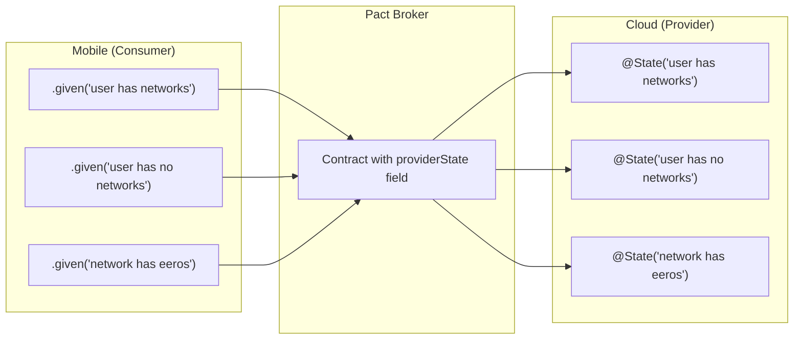

# Contract & Integration Testing — Implementation Guide

**Author:** Maria Rebelo (QAE, Core Engineering)
**Date:** 2026-08-31
**Audience:** Cloud Engineering (primary) · iOS and Android (reference)
**Status:** Handoff document. Two approaches, documented to the point where either can be started without another meeting.

**Evidence base:** [Contract & Integration Test Gap Analysis — August 2026](./contract-integration-test-gap-analysis.html). Read the Executive Summary and the "Where the shipped tests hit their ceiling" tab first if you want the *why*; this document is the *how*.

---

## How to read this document

This is a consolidation of four earlier documents plus what has been learned since shipping the reference implementation:

| Source | Date | What it contributed |
|---|---|---|
| `Pact Contract Testing — Technical Overview` | 2026-06-03 | The spine: flow, contract anatomy, provider states, broker, `can-i-deploy`, catches/doesn't, industry evidence |
| `Pact Provider Verification: Cloud (revised v2)` | 2026-06-03 | Provider side — library, test placement, verification example, CI job, state options |
| `RFC: Pact Contract Testing for Mobile` | 2026-05-27 | Consumer CI wiring, rollout phases, success metrics, risks |
| `Pact Provider Verification — Cloud Repo` | 2026-05-27 | Rollout table and effort estimate (dropped from the v2 revision) |

Everything factual about `eero-inc/cloud` has been re-verified against the repo at `main` for this document. **Three claims from the May RFCs were stale and are corrected here** — see [Appendix A](#appendix-a--verified-environment-facts). Two implementation gaps the earlier docs did not cover are called out inline and flagged **NEW**.

---

## 1. Why this exists

Between 2026-07-21 and 2026-08-31, CORE filed 325 bugs. **48 were contract, state-sync, or platform-parity failures — 24 of them P0 or P1.** The rate has held between 7 and 8 per week across three consecutive snapshots. It is not improving on its own.

**15 of those 48 are producer-side defects that no client-side test can catch.** A handful, verbatim from the tickets:

- **CORE-32502** — cloud marks the WAN link `name` field optional; the Apollo GraphQL contract declares it required. The Insight query breaks whenever it is absent. *Two schemas, one field, opposite answers.*
- **CORE-32695** — `PUT /2.2/networks/:id/settings` accepts the string `"true"` for a boolean field, coerces it, stores it, **and reboots the network**. `null` returns 200. A number returns 400.
- **CORE-32631** — a `PUT` to a non-existent network id returns 200 and persists a real override record.
- **CORE-33044** — the `/config` response omits the `wan` field on the boot path, silently disabling Multi-WAN. A later `config` action returns it correctly.
- **CORE-33268** — a gauge emits `Double.PositiveInfinity`; `DecimalFormat` renders the Unicode `∞` glyph; Telegraf's statsd parser cannot read it as float64. Paged PROD.
- **CORE-33380** — DynamoDB throttling surfaces as gRPC `INTERNAL` (13) instead of a retryable status. 1,744 of ~171k calls in one hour; the alert has flapped 212 times.

Every one of these is a producer emitting something a consumer cannot consume. That is the definition of a contract violation, and it is fixable at PR time.

---

## 2. What already ships on mobile

Contract + integration tests for MACsec Port Security are **merged on both platforms** and run in the standard unit suite on every PR, with **zero new dependencies and zero new CI jobs**:

- **Android** — PR #13181, merged 2026-07-30, commit `dd9f38f4`. `app/src/test/kotlin/com/eero/android/contract/portsecurity/{PortSecurityContractTest.kt, PortSecurityFixtures.kt}` — 12 `CT-*` tests; 3 `INT-001..003` in `PortDetailViewModelTest.kt`
- **iOS** — PR #14285, merged 2026-08-03, commit `74221e2c`. `Eero/EeroNetworking/Tests/Port Security Tests/PortSecurityContractTests.swift` — 12 `@Test` scenarios; 3 `INT-001..003` in `PortDetailsTests.swift`

An earlier iteration gated these behind an opt-in `test:contract` job with a diff-scoped selection script and a `run-contract-tests` label. That was dropped after review with an Android engineer: the tests are fast, deterministic and dependency-free, so there is no reason to treat them differently from any other unit test.

**That decision does not transfer to Pact.** Pact provider verification needs a broker and a running application instance, so it is neither fast nor dependency-free. Section 6.7 treats its trigger as an open question rather than a settled one.

### What shipped, and what it missed

**CORE-33235** landed on 2026-08-25 against MACsec Port Security — the interface with 12 contract tests on each platform. The tests passed. The bug shipped.

The app renders Port Security as `enabled` on a port where neither the node's bookshelf nor cloud `state_data` reports MACsec, and where cloud reports the port as not MACsec-capable. It derives `enabled` from the **pair-facing** port. The tests asserted that the client *decodes* the payload correctly; the client decoded correctly and then derived the wrong thing. The fixture set had no case for that hardware topology.

Two lessons that shape this document:

1. A decode-boundary fixture test validates the client against a recording, and **a recording cannot disagree with you**. Fixture coverage is bounded by imagination — the same weakness as mocks, shared between platforms rather than per-developer.
2. Cloud already held the correct answer. A contract the **provider** verifies would have failed in cloud CI, where the truth lived.

That is the case for Approach B existing at all, and the reason this guide is not simply "do what mobile did."

---

## 3. The two approaches, side by side

| | **Approach A — Golden-fixture contract tests** | **Approach B — Pact consumer-driven contracts** |
|---|---|---|
| **What is asserted** | A recorded payload parses into the expected model, and derived state matches expectation | The provider's live response satisfies the consumer's declared expectation |
| **Who holds the truth** | Whoever recorded the fixture | The provider, at verification time |
| **New dependencies** | None | pact-jvm (provider), PactSwift (iOS), pact-jvm consumer (Android), broker |
| **New infrastructure** | None | Pact Broker (Pactflow SaaS or self-hosted) |
| **Runs where** | Existing unit suite, every PR | Dedicated CI job; needs a running app instance |
| **Runtime** | Milliseconds | Seconds to minutes (app start + replay) |
| **Catches a stale fixture** | ❌ No — the fixture *is* the assertion | ✅ Yes — that is the whole point |
| **Catches provider-side drift** | ❌ No | ✅ Yes |
| **Catches iOS/Android divergence** | ✅ Yes, cheaply — its strongest use | Partly — only where both declare the same interaction |
| **Catches write-path defects** (persist-orphan, no-op save) | ❌ No | ✅ Yes |
| **Setup cost** | Hours | ~2–3 days initial, then ~1–2 h per endpoint |
| **Proven here?** | ✅ Merged and running on both platforms | ❌ Not adopted anywhere in the codebase |

### Which to use for which bug class

Mapped against the 48 categorized bugs in the August window:

| Interface / defect class | Approach A reaches it? | Approach B needed? |
|---|---|---|
| iOS/Android label, localization and row-set parity (17 bugs) | ✅ Yes — cheapest and best fit | No |
| Response nullability and decode tolerance (CORE-32415) | ✅ Yes | Optional |
| Enum exhaustiveness over hw-model, client half (CORE-33269) | ✅ Yes | No |
| Enum exhaustiveness, cloud half (CORE-32903) | ❌ No — producer-side | ✅ Yes |
| Field optionality disagreement across two schemas (CORE-32502) | ❌ No | ✅ Yes |
| Request-validation defects (CORE-32695, CORE-32631) | ❌ No — a fixture cannot reject a write | ✅ Yes |
| Boot-path response omitting a field (CORE-33044) | ❌ No | ✅ Yes |
| Error-code and status mapping (CORE-33380, CORE-32964) | ❌ No | ✅ Yes |
| Emit-boundary format (CORE-33268) | ❌ No | ❌ Neither — this is a plain unit test at the emit site |
| `active` flag vs actual default route (CORE-32917, 33148, 33341) | ❌ No | ❌ Neither — needs an **integration** test, §7 |
| Write→read round-trips (CORE-33320, 32463, 33188) | ❌ No | ❌ Neither — needs an **integration** test, §7 |

**The honest read:** Approach A is the right default for the client side and covers the largest single category (parity, 17 bugs) at near-zero cost. Approach B is what makes the cloud side of the boundary answerable. Neither covers the state-sync category — that needs integration tests, which §7 addresses separately.

**Recommendation:** adopt both, in this order — Approach A on the cloud side for cheap producer-side unit contracts (§4.3), Approach B for the two or three highest-churn mobile↔cloud interfaces (§5), integration tests for the state-sync invariants (§7). Do not start with the broker.

---

## 4. Approach A — Golden-fixture contract tests

### 4.1 The pattern, as shipped

One consolidated JSON file holds every scenario, keyed by contract-test id. Tests load a scenario, parse it **through the production decoder**, and assert on the resulting model.

From `PortSecurityFixtures.kt` (Android, merged):

```kotlin
internal object PortSecurityFixtures {

    private const val FIXTURE_PATH = "fixtures/port_security/scenarios.json"

    /**
     * Use the app's GsonFactory so `PortConnectionStatus` (a sealed class with a
     * discriminated `type` field) parses through the same `RuntimeTypeAdapterFactory`
     * the production code uses. A plain `Gson()` throws JsonIOException on the
     * abstract base type in modern Gson versions.
     */
    val gson: Gson by lazy { GsonFactory.create() }

    private val scenarios: Map<String, JsonObject> by lazy { loadScenarios() }

    fun payloadOf(scenarioId: String): JsonObject { /* strips `description`, returns payload */ }

    inline fun <reified T> parseAs(scenarioId: String): T =
        gson.fromJson(payloadOf(scenarioId), T::class.java)
}
```

Two details that matter more than they look:

1. **Parse through the production decoder, not a fresh one.** The comment above is load-bearing: a plain `Gson()` behaves differently from `GsonFactory.create()` on sealed types. A contract test that builds its own parser tests the parser, not the contract.
2. **Scenario ids map to a plan.** Each key corresponds to a `CT-` id in the automation plan, with a `README.md` holding the mapping. That is what makes the suite auditable rather than a pile of JSON.

Tests then read as executable specifications:

```kotlin
@Test
fun `CT-001 port not MACsec-capable parses with capable=false, status=DISABLED`() { ... }

@Test
fun `CT-002 capable, security off, device connected parses with capable=true, enabled=false, DISABLED`() { ... }

@Test
fun `CT-013 POST toggle error parses meta with non-200 code and mapped EeroError`() { ... }
```

### 4.2 What to fix in the pattern before copying it

Copy it, but do not copy its blind spot. CORE-33235 escaped because the suite asserted decoding and not derivation.

**Rule: for every field the UI renders, assert the predicate that produces it, not just that the field parsed.** For Port Security that is:

> For each port, `enabled` equals the node-reported state for **that** port — never a paired port, never a network-level flag.

Add that test to both platforms. It is a handful of lines and it closes a demonstrated gap in the pattern we are asking other teams to adopt.

### 4.3 The cloud-side equivalent (Scala, no broker) — **recommended starting point**

Approach A translates to the provider side, where it catches a real class of the August bugs with no new dependencies at all. The house test framework is ScalaTest 3.2.19 (verified — see Appendix A), so these are ordinary specs.

**Pattern 1 — request validation.** Directly targets CORE-32695 and CORE-32631:

```scala
class NetworkSettingsContractSpec extends AnyFunSpec with Matchers {

  describe("PUT /2.2/networks/:id/settings — nat_port_randomization") {

    // CORE-32695: the string "true" was accepted, coerced, stored, and rebooted the network
    it("rejects a non-boolean value with 400 and performs no side effect") {
      forAll(Table("payload", """"true"""", """"false"""", "1", "0", "null")) { raw =>
        val res = route(app, settingsPut(networkId, s"""{"nat_port_randomization": $raw}""")).get
        status(res) shouldBe BAD_REQUEST
        rebootsIssuedFor(networkId) shouldBe 0
      }
    }

    it("accepts a real boolean") {
      status(route(app, settingsPut(networkId, """{"nat_port_randomization": true}""")).get) shouldBe OK
    }
  }
}
```

**Pattern 2 — enum exhaustiveness.** Directly targets CORE-32903, and would have caught its client-side twin CORE-33269 at the source:

```scala
class HwModelCapabilityContractSpec extends AnyFunSpec with Matchers {

  // CORE-32903: Dejavu was absent from wlanRateLimitPolicyCapable with no firmware gate,
  // so any PUT subnet carrying a ratelimitConfig was rejected InvalidRateLimitParameters.
  it("names every hw model explicitly in every capability table") {
    val undecided = HwModel.values.filterNot { m =>
      HwModelCapabilityService.capabilityTables.forall(_.isDefinedFor(m))
    }
    withClue("models missing an explicit allow/deny — adding a model must not default silently: ") {
      undecided shouldBe empty
    }
  }
}
```

The point of Pattern 2 is that **it fails when someone adds a new hardware model** until every capability table has been reviewed. That converts a recurring class of bug into a compile-time-ish gate. It needs `capabilityTables` to be enumerable, which may mean a small refactor — that is the actual work item, and it is worth it.

**Pattern 3 — status-code mapping.** Targets CORE-33380 and CORE-32964:

```scala
it("maps a throttled downstream to a retryable gRPC status, never INTERNAL") {
  val res = withDownstreamFailure(ThrottlingException) { getNetworkNodes(networkId) }
  res.getStatus.getCode should (be(Status.Code.RESOURCE_EXHAUSTED) or be(Status.Code.UNAVAILABLE))
  res.getStatus.getCode should not be Status.Code.INTERNAL
}
```

**Effort:** hours per pattern. No dependencies, no broker, no CI changes — these run in the existing test job for their module. **If you do nothing else from this document, do §4.3.**

---

## 5. Approach B — Pact consumer-driven contracts

### 5.1 What Pact is

Pact keeps the mobile apps and the cloud API compatible without running them together in an integration environment. It catches breaking contract changes — renamed fields, removed endpoints, changed response shapes — at PR time.

| Side | Who | What they do |
|---|---|---|
| **Consumer** (mobile) | iOS / Android repos | Write tests declaring: "I call this endpoint with these params and expect this response shape" |
| **Provider** (cloud) | `eero-inc/cloud` | Run verification proving: "Yes, I actually return what mobile expects" |

The flow:

```
1. Mobile writes a consumer test
2. Test generates a contract file (JSON "pact")
3. Contract is published to the Pact Broker (shared registry)
4. Cloud CI pulls contracts from the Broker
5. Cloud replays each interaction against a running instance
6. Results are published back to the Broker
7. "Can I deploy?" check gates both sides before merge/release
```



### 5.2 What is in a contract

```json
{
  "provider": "eero-cloud",
  "consumer": "eero-ios",
  "interactions": [
    {
      "description": "a request for user networks",
      "providerState": "user has networks",
      "request": {
        "method": "GET",
        "path": "/2.2/account/networks",
        "headers": { "Authorization": "Bearer token" }
      },
      "response": {
        "status": 200,
        "headers": { "Content-Type": "application/json" },
        "body": { "networks": [{ "id": "string", "name": "string" }] },
        "matchingRules": { "$.body.networks": { "min": 1 } }
      }
    }
  ]
}
```

The response body uses **matching rules**, not exact values. Pact checks structure and types, not literal data. This is the property that makes it robust where a golden fixture is brittle — and also why it does not catch wrong *values*.

### 5.3 Consumer side — iOS (PactSwift)

```swift
import PactSwift

class NetworksContractTest: XCTestCase {

    var mockService: MockService!

    override func setUp() {
        super.setUp()
        mockService = MockService(
            consumer: "eero-ios",
            provider: "eero-cloud"
        )
    }

    func testGetUserNetworks() {
        mockService
            .given("user has networks")
            .uponReceiving("a request for user networks")
            .withRequest(
                method: .GET,
                path: "/2.2/account/networks",
                headers: ["Authorization": "Bearer token"]
            )
            .willRespondWith(
                status: 200,
                headers: ["Content-Type": "application/json"],
                body: [
                    "networks": Matcher.eachLike([
                        "id": Matcher.somethingLike("abc123"),
                        "name": Matcher.somethingLike("Home Network"),
                        "connected_clients_count": Matcher.integerLike(5)
                    ])
                ]
            )

        // Runs the real client against a local mock server
        mockService.run { baseURL, done in
            let client = NetworksAPIClient(baseURL: baseURL)
            client.getUserNetworks { result in
                switch result {
                case .success(let networks):
                    XCTAssertFalse(networks.isEmpty)
                    XCTAssertNotNil(networks.first?.id)
                    XCTAssertNotNil(networks.first?.name)
                case .failure(let error):
                    XCTFail("Expected success, got \(error)")
                }
                done()
            }
        }
    }
}
```

### 5.4 Consumer side — Android (pact-jvm consumer)

```kotlin
import au.com.dius.pact.consumer.dsl.PactDslWithProvider
import au.com.dius.pact.consumer.junit5.PactConsumerTestExt
import au.com.dius.pact.consumer.junit5.PactTestFor
import au.com.dius.pact.consumer.dsl.LambdaDsl.newJsonBody
import au.com.dius.pact.core.model.V4Pact
import au.com.dius.pact.core.model.annotations.Pact
import org.junit.jupiter.api.Test
import org.junit.jupiter.api.extension.ExtendWith

@ExtendWith(PactConsumerTestExt::class)
@PactTestFor(providerName = "eero-cloud")
class NetworksContractTest {

    @Pact(consumer = "eero-android")
    fun getUserNetworksPact(builder: PactDslWithProvider): V4Pact {
        return builder
            .given("user has networks")
            .uponReceiving("a request for user networks")
            .path("/2.2/account/networks")
            .method("GET")
            .headers(mapOf("Authorization" to "Bearer token"))
            .willRespondWith()
            .status(200)
            .headers(mapOf("Content-Type" to "application/json"))
            .body(newJsonBody { root ->
                root.array("networks") { networks ->
                    networks.`object` { network ->
                        network.stringType("id", "abc123")
                        network.stringType("name", "Home Network")
                        network.integerType("connected_clients_count", 5)
                    }
                }
            }.build())
            .toPact(V4Pact::class.java)
    }

    @Test
    @PactTestFor(pactMethod = "getUserNetworksPact")
    fun testGetUserNetworks(mockServer: MockServer) {
        val client = NetworksAPIClient(baseUrl = mockServer.getUrl())
        val response = client.getUserNetworks()

        assertThat(response.isSuccessful).isTrue()
        assertThat(response.body()!!.networks).isNotEmpty()
        assertThat(response.body()!!.networks.first().id).isNotNull()
    }
}
```

### 5.5 Publishing the contract

The consumer test generates a pact JSON file locally; a CI step publishes it:

```bash
# iOS (after test run)
pact-broker publish ./pacts \
  --consumer-app-version $CI_COMMIT_SHA \
  --branch $CI_COMMIT_BRANCH \
  --broker-base-url $PACT_BROKER_URL \
  --broker-token $PACT_BROKER_TOKEN

# Android (Gradle plugin handles it)
./gradlew pactPublish
```

### 5.6 Provider side — cloud

#### Environment (verified 2026-08-31 against `eero-inc/cloud` at `main`)

| | Value | vs. May RFCs |
|---|---|---|
| Scala | **2.13.18** | RFCs said 2.12 — **corrected** |
| sbt | 1.12.1 (`project/build.properties`) | Confirmed |
| Play | 2.9.10 (`sbt-plugin`) | Confirmed ("2.9") |
| CI | GitLab CI, `cl generateTestsPipeline` at `.gitlab-ci.yml:134` | Confirmed |
| Test frameworks | ScalaTest 3.2.19, scalatestplus-play 6.0.0, mockito-5-18, scalacheck-1-18 | Not covered by the RFCs |
| JUnit interface | `com.github.sbt % junit-interface % 0.13.3` — **JUnit 4 only** | Not covered by the RFCs |
| Modules | 195 under `modules/` | — |
| Existing Pact usage | None — no match in `project/Dependencies.scala` or `build.sbt` | Greenfield |

#### Library

[pact-jvm](https://github.com/pact-foundation/pact-jvm) — the JVM provider verification library, Apache 2.0, maintained by the Pact Foundation.

> **Security review:** submit a review request for `au.com.dius.pact.provider` before merging to main, per the standard process for new third-party dependencies.

Add to `project/Dependencies.scala`:

```scala
val pactVersion  = "4.6.14"   // version pinned by the May 2026 RFCs — confirm the current release at adoption time
val pactProvider = "au.com.dius.pact.provider" % "junit5" % pactVersion % Test
```

Then in the module's `build.sbt`:

```scala
libraryDependencies += Dependencies.pactProvider
```

#### ⚠️ **NEW — sbt cannot run these tests as configured**

`pact-jvm`'s provider API is **JUnit 5 (Jupiter)** first: `@TestTemplate` plus `PactVerificationInvocationContextProvider` are Jupiter constructs. The repo has `junit-interface 0.13.3`, which is a **JUnit 4** sbt bridge. sbt has no native JUnit 5 runner.

Two ways out, both real work the earlier RFCs did not budget:

**Option 1 — add a Jupiter interface (smaller change).** Add the sbt Jupiter bridge and register the framework for the verification module only:

```scala
// project/plugins.sbt
addSbtPlugin("com.github.sbt.junit" % "sbt-jupiter-interface" % "<current>")

// modules/pactVerification/build.sbt
testFrameworks += new TestFramework("com.github.sbt.junit.jupiter.api.JupiterFramework")
```

Scoping it to one module keeps the other 194 modules on ScalaTest untouched.

**Option 2 — drive pact-jvm from ScalaTest (no new test framework).** Use `ProviderVerifier` / `ProviderVerifierBase` directly instead of the JUnit5 annotation surface, and wrap it in an ordinary `AnyFunSpec`. More code to write once, zero build-infrastructure change, and it stays idiomatic for the repo.

**Recommendation: Option 1 for the spike, and decide properly before it spreads.** Option 2 is likely the better long-term fit for a 195-module ScalaTest codebase, but Option 1 gets a working verification in an afternoon and the annotation surface is what all the upstream documentation assumes. This is the single biggest unknown in the whole plan and it should be resolved by a timeboxed spike, not by a document.

#### Where tests live

A dedicated module fits the existing `modules/` layout:

```
modules/pactVerification/
  src/test/scala/pact/
    MobileContractVerificationSpec.scala
```

Alternatively place them alongside the API module they verify, e.g. `modules/user/src/test/scala/pact/`.

#### How verification works

Pact does **not** read or introspect `.routes` files. The consumer contracts published by mobile already contain the full HTTP interactions — method, path, headers, expected response. The verification test starts the Play app (or targets a running instance such as `stage-ci`, which rebuilds on every commit), replays each interaction as a **real HTTP request**, and asserts the actual response matches the contract. If the route does not exist or the response shape changed, the test fails.



#### Verification test (JUnit5 surface — Option 1)

```scala
import au.com.dius.pact.provider.junit5._
import au.com.dius.pact.provider.junitsupport._
import au.com.dius.pact.provider.junitsupport.loader._
import org.junit.jupiter.api.{BeforeEach, TestTemplate}
import org.junit.jupiter.api.extension.ExtendWith

@Provider("eero-cloud")
@PactBroker(
  url = "${PACT_BROKER_URL}",
  authentication = @PactBrokerAuth(token = "${PACT_BROKER_TOKEN}")
)
class MobileContractVerificationSpec {

  @TestTemplate
  @ExtendWith(Array(classOf[PactVerificationInvocationContextProvider]))
  def verifyPact(context: PactVerificationContext): Unit = {
    context.verifyInteraction()
  }

  @BeforeEach
  def setUp(context: PactVerificationContext): Unit = {
    // Point at a running Play app instance
    context.setTarget(new HttpTestTarget("localhost", 9000))
  }

  // --- Provider States ---
  // Each @State matches a .given("...") from a mobile consumer test

  @State("user has networks")
  def setupUserWithNetworks(): Unit = {
    TestDB.seedUser(userId = "test-user", networks = List(
      Network(id = "net-001", name = "Home Network", connectedClients = 5),
      Network(id = "net-002", name = "Office",       connectedClients = 3)
    ))
  }

  @State("user has no networks")
  def setupUserWithNoNetworks(): Unit = {
    TestDB.seedUser(userId = "test-user", networks = List.empty)
  }

  @State("network has eeros")
  def setupNetworkWithEeros(): Unit = {
    TestDB.seedNetwork(networkId = "net-001", eeros = List(
      Eero(serialNumber = "SN001", model = "eero Pro 6E", status = "online"),
      Eero(serialNumber = "SN002", model = "eero 6+",     status = "offline")
    ))
  }
}
```

Key points:

- `@Provider("eero-cloud")` must match the provider name in the mobile consumer tests
- `@State` methods set up the preconditions mobile declared via `.given(...)`
- The test replays each interaction from the pact against a real server

### 5.7 Provider states — the bridge between mobile and cloud



**Mobile defines what states exist. Cloud defines how to set them up.** Writing `@State` handlers is the bulk of the ongoing provider-side effort.

| Approach | Description | Trade-off |
|---|---|---|
| **In-memory test server** | Start Play in test mode with an in-memory/test database. The HTTP server is still real; only the data layer is ephemeral | Fast, isolated — **recommended** for most cases |
| **Docker-compose** | Full stack with a test DB | More realistic, heavier, slower CI |
| **State endpoint** | Expose a test-only `POST /_pact/state`; Pact posts `{"state": "user has networks"}` before each interaction and the app seeds internally | Clean separation; useful when setup needs internal services not callable from external test code. Requires a test-only route |

> ⚠️ **NEW — a note on `@State` and 195 modules.** The `TestDB.seedUser(...)` calls above are illustrative, not real API. Before committing to Pact, confirm what a seeding harness looks like against the actual persistence layer for the endpoints in scope. If seeding a user with networks requires touching several modules, the **state endpoint** option becomes considerably more attractive than the table above implies, because the app can do the seeding through its own services. Resolve this in the same spike as the JUnit5 question.

### 5.8 The broker

A central server that:

- Stores versioned contracts, tagged by branch and commit
- Stores verification results from the provider
- Answers **"can I deploy?"** in both directions
- Triggers webhooks — e.g. re-run cloud verification when mobile publishes a new contract

**Hosting:** Pactflow SaaS for initial adoption — zero ops overhead, built-in `can-i-deploy`, webhook support. Evaluate a self-hosted Docker broker if cost becomes a concern.

#### can-i-deploy

Both sides run this before merge:

```bash
# Mobile asks: "Is the current cloud compatible with my new contract?"
pact-broker can-i-deploy \
  --pacticipant eero-ios \
  --version $CI_COMMIT_SHA \
  --to-environment production \
  --broker-base-url $PACT_BROKER_URL \
  --broker-token $PACT_BROKER_TOKEN

# Cloud asks: "Does my change still satisfy all mobile contracts?"
pact-broker can-i-deploy \
  --pacticipant eero-cloud \
  --version $CI_COMMIT_SHA \
  --to-environment production \
  --broker-base-url $PACT_BROKER_URL \
  --broker-token $PACT_BROKER_TOKEN
```

If either fails, the PR is blocked. Breaking changes surface in the PR that introduces them, on whichever side that is.

### 5.9 CI integration

#### Cloud (`.gitlab/global-test.gitlab-ci.yml`)

This job does not depend on the dynamically generated test matrix from `cl generateTestsPipeline`. It verifies against `stage-ci`, which runs on every commit:

```yaml
pact:verify:
  stage: globalTest
  tags:
    - 5xlarge
  rules:
    - if: $EPHEMERAL_LOCAL_DEPLOY == "true"
      when: never
    - if: $CI_COMMIT_TAG
      when: never
    - when: on_success
  script:
    - ./bin/get_maven_creds.sh
    - ./bin/fetch_amazon_artifacts.sh
    - sbt "pactVerification/test"
    - |
      pact-broker can-i-deploy \
        --pacticipant eero-cloud \
        --version $CI_COMMIT_SHA \
        --broker-base-url $PACT_BROKER_URL \
        --broker-token $PACT_BROKER_TOKEN
  cache:
    key: $SCALA_CACHE_KEY
    policy: pull
    paths:
      - .ivy2
      - .sbt
  timeout: 30m
```

#### Mobile — and an open question on the trigger

The May RFC proposed an **opt-in trigger**: Pact jobs run only when a commit message in the PR carries a `[pact]` tag.

```yaml
# iOS (.gitlab-ci.yml)
pact:consumer:
  stage: integration tests
  rules:
    - if: $CI_PIPELINE_SOURCE == "trigger" && $CI_COMMIT_MESSAGE =~ /\[pact\]/
    - if: $CI_PIPELINE_SOURCE == "external_pull_requests" && $CI_COMMIT_MESSAGE =~ /\[pact\]/
  script:
    - bundle exec fastlane run_pact_tests
    - pact-broker publish pacts/ --consumer-app-version=$CI_COMMIT_SHA --broker-base-url=$PACT_BROKER_URL --broker-token=$PACT_BROKER_TOKEN

# Android (.test-include.yml)
test:pact:
  stage: test
  rules:
    - if: $CI_PIPELINE_SOURCE == "external_pull_requests" && $CI_COMMIT_MESSAGE =~ /\[pact\]/
  script:
    - ./gradlew :data:network:test --tests "*.pact.*"
    - pact-broker publish data/network/build/pacts/ --consumer-app-version=$CI_COMMIT_SHA --broker-base-url=$PACT_BROKER_URL --broker-token=$PACT_BROKER_TOKEN
```

**Flagging this honestly:** an equivalent opt-in mechanism was proposed for the golden-fixture tests and **rejected** in review, on the grounds that a test which only runs when someone remembers a tag is not a gate. That reasoning applies here too — a commit-message tag will be forgotten precisely on the PR that breaks a contract.

The counter-argument is real: unlike the fixture tests, Pact consumer tests need a broker round-trip, so running them on every PR couples every mobile PR to broker availability. Reasonable middle grounds:

- Run consumer tests on every PR (they only need a local mock server), but publish and `can-i-deploy` only on merge to the main branch
- Run on every PR touching the API client layer, path-filtered rather than tag-filtered
- Keep `can-i-deploy` advisory (non-blocking) until the broker has proven stable, then promote it to a gate

**Decide this deliberately.** It is the difference between a gate and a suggestion, and it is the mistake most worth avoiding twice.

### 5.10 Webhook (optional)

Configure the broker to trigger cloud CI when a new consumer contract is published, so provider verification runs without waiting for a cloud PR:

```
Broker webhook → GitLab pipeline trigger → pact:verify job
```

### 5.11 Technical reference

| Aspect | Detail |
|---|---|
| Library (cloud) | `au.com.dius.pact.provider:junit5:4.6.14` |
| Library (iOS) | PactSwift |
| Library (Android) | `au.com.dius.pact.consumer:junit5:4.6.14` |
| Contract format | Pact Specification v4 (JSON) |
| Transport | Real HTTP — the provider starts an actual server and Pact makes real requests |
| Matching | Type-based by default; also regex, min/max array size, date formats |
| State management | `@State` (provider) ↔ `.given()` (consumer) |
| CI gating | `pact-broker can-i-deploy` CLI |
| Versioning | Contracts tagged by git SHA + branch |

---

## 6. What contract testing catches — and what it does not

### Catches

- Removed or renamed fields in API responses
- Changed response types (string → int, array → object)
- Removed endpoints (404)
- Changed status codes
- Added required request fields the consumer does not send
- Missing response headers

### Does NOT catch

- Business logic bugs — correct shape, wrong data
- Performance issues
- Auth and permission edge cases, unless explicitly contracted
- UI rendering issues
- Multi-request stateful flows — each interaction is independent
- Data correctness — Pact checks types, not values

### Mapped to the August evidence

That last list is not abstract. Of the 48 categorized bugs, **16 are Category 2 state-sync defects that neither Approach A nor Approach B catches**, because the shape was right and the data was wrong:

- **CORE-33320** — the SSID write returns success and is audit-logged, and is never applied
- **CORE-32917 / CORE-33148 / CORE-33341** — a WAN link reports `active: true` while another holds the default route. Perfectly valid boolean
- **CORE-32327** — a removed accessory is still returned. Valid response, wrong contents
- **CORE-33055** — a retried activation issues a second ICCID. Both responses well-formed

Contract testing validates the interface. **Do not let it be sold as covering these.** They need §7.

---

## 7. Integration tests — the part contract testing does not cover

Category 2 needs a different assertion: **a write is visible on the read path, and a reported status matches physical reality.** These are integration tests, and they are cheaper than they sound because most can run against faked API clients rather than staging.

The invariants worth encoding first, each traceable to a P0 or P1 in the August window:

| Invariant | Tickets |
|---|---|
| Exactly one WAN link reports `active: true`, and it is the one holding the default route — asserted across DHCP, Static, PPPoE **and their VLAN variants** | CORE-32917, 33148, 33341 |
| After a settings write returns success, the next read returns the new value. Audit-log success is not acceptance | CORE-33320, 32463, 33188 |
| Setup reports success only after the network is reachable through the read path the app uses | CORE-33057, 33304 |
| After a removal returns success, the entity is absent from the read path regardless of power state | CORE-32327 |
| A retried activation is idempotent — one device converges on one ICCID | CORE-33055 |
| Every node written on the factory line is readable from cloud within N minutes; the sync cursor cannot advance past unread rows | CORE-33309, 32469 |
| An addressing-mode change applies to every subnet or to none | CORE-33364 |
| A KV read failure retains the last good policy map — empty is never a valid substitute | CORE-32766 |

The Android `PortDetailViewModel` INT-001..003 pattern — fake API client, assert on emitted state — is directly reusable for the client half of these. The cloud half is ordinary ScalaTest against a test database.

**The VLAN detail in the first row is worth noting.** CORE-33341 reproduces on DHCP+VLAN, Static+VLAN and PPPoE+VLAN, and **not** on any of them without VLAN. An invariant asserted only over the base connection types would have passed. Enumerate the variant matrix, do not sample it.

---

## 8. Rollout and effort

### Recommended sequence

| Phase | Scope | Effort | Owner |
|---|---|---|---|
| **0** | **§4.3 cloud-side golden-fixture specs** — request validation, enum exhaustiveness, status mapping. No dependencies, no broker, no CI change | Hours per pattern | Cloud |
| **0b** | Add the CORE-33235 per-port derivation test on iOS + Android | ~1 h each | Mobile / QAE |
| **1** | **Timeboxed spike** — resolve the JUnit5-vs-ScalaTest question (§5.6) and the `@State` seeding question (§5.7) against two real endpoints | 2–3 days | Cloud |
| **2** | Pact consumer tests for 1–2 critical endpoints (`/2.2/account/networks`, `/login`), iOS first | 2 weeks | Mobile |
| **3** | Same endpoints on Android + provider verification job in cloud CI, broker connected | 2 weeks | Mobile + Cloud |
| **4** | Expand to 5–10 high-churn endpoints; promote `can-i-deploy` from advisory to merge gate | 4 weeks | Both |
| **5** | Integration-test invariants from §7, starting with the WAN `active` matrix | Ongoing | Both |
| **6** | Policy: all net-new API work carries a contract test | Ongoing | Both |

Start narrow, prove value, expand. No big-bang migration. **Phase 0 has no prerequisites and should not wait on any of the others.**

### Effort estimate (provider side)

- **Initial setup** — dependency, CI job, 2 endpoint verifications: ~2–3 days *(assumes the Phase 1 spike resolved cleanly; if Option 2 in §5.6 is chosen, add 1–2 days)*
- **Per endpoint, ongoing** — ~1–2 hours, mostly writing `@State` handlers
- **Maintenance** — minimal. Contracts are owned by mobile; cloud verifies

### Success metrics

| Metric | Target (6 months) |
|---|---|
| API-contract bugs found post-merge | ≥ 70% reduction |
| Device farm failures attributed to API drift | ≥ 50% reduction |
| Mean time from contract break to developer notification | < 10 min (PR CI) |
| Backend PRs verified against consumer contracts | 100% of API-surface PRs |
| Categorized bugs per week (gap-analysis measure) | Below 8.0/wk and falling |

That last row is the one to actually watch. It is measured the same way in every snapshot and it has not moved in three months.

---

## 9. Risks and mitigations

| Risk | Mitigation |
|---|---|
| **Maintenance burden** — contracts drift from real usage | Integrate contract generation into existing API model layers; review contracts in PR diffs like any other test |
| **False confidence** — passing contracts ≠ working system | Scope contract testing explicitly to shape validation. §6 and §7 exist to keep this honest. Retain integration and E2E suites for behavioural coverage |
| **Broker availability** — CI blocked if the broker is down | Pactflow SaaS with an SLA; make `can-i-deploy` advisory until stability is proven; add a circuit-breaker so CI degrades rather than blocks |
| **Adoption friction** — teams unfamiliar with consumer-driven testing | Starter templates for Swift and Kotlin; pair on the first 2–3 contracts per team. Approach A already has a merged reference on both platforms |
| **Build-infrastructure surprise** — JUnit5 does not run under sbt as configured | This is the Phase 1 spike. Do not commit to a rollout date before it resolves |
| **`@State` seeding is harder than the examples suggest** | Same spike. The state-endpoint option exists precisely for this case |
| **The opt-in trigger quietly makes it non-blocking** | §5.9 — decide the trigger deliberately, and prefer path filters over commit-message tags |
| **Fixture rot in Approach A** | Fixtures are recordings and cannot disagree with you. Pair them with a periodic refresh from staging, and prefer Approach B for interfaces where drift is the main risk |

---

## Appendix A — Verified environment facts

Verified 2026-08-31 against `eero-inc/cloud` at `main`. **The May 2026 RFCs asserted Scala 2.12; it is 2.13.18.** Everything below was read from the repo, not carried forward.

| Fact | Value | Source |
|---|---|---|
| Scala version | `2.13.18` | `scalaVersion := "2.13.18"` |
| sbt version | `1.12.1` | `project/build.properties` |
| Play (sbt-plugin) | `2.9.10` | `project/plugins.sbt` |
| play-json | `2.10.6` | `project/Dependencies.scala` |
| CI | GitLab CI; `cl generateTestsPipeline` | `.gitlab-ci.yml:134` |
| ScalaTest | `3.2.19` | `project/Dependencies.scala` |
| scalatestplus-play | `6.0.0` | `project/Dependencies.scala` |
| mockito | `mockito-5-18` (`3.2.19.0`) | `project/Dependencies.scala` |
| scalacheck | `scalacheck-1-18` (`3.2.19.0`) | `project/Dependencies.scala` |
| JUnit sbt bridge | `com.github.sbt % junit-interface % 0.13.3` — **JUnit 4** | `project/Dependencies.scala:465` |
| Jupiter (JUnit 5) support | **None** | No match in `project/plugins.sbt` |
| Modules | 195 under `modules/` | `ls -d modules/*/` |
| Existing Pact usage | None | No match in `project/Dependencies.scala`, `build.sbt` |

`pact-jvm 4.6.14` is the version pinned by the May RFCs and has not been re-checked against the current upstream release. Confirm before adding the dependency.

---

## Appendix B — Industry evidence

Carried forward from the June technical overview. Presented as supporting context; the August gap analysis is the local evidence and is the stronger argument.

### Case studies (Pact Foundation)

| Organization | Result |
|---|---|
| **Atlassian** (Jira) | Reduced API feedback loops from days/weeks to hours. Enabled parallel development — integration teams could begin implementation without waiting for the API to be complete |
| **ITV** (1B+ on-demand requests, 17M users, 27 platforms) | Eliminated tightly coupled integration test environments entirely. Services tested and deployed independently |
| **John Lewis & Partners** | Gave the team confidence to remove all E2E tests they previously had. No longer reliant on other services being available for their pipeline to stay green |
| **Mastercard** | Eliminated API specification drift between teams |
| **UK Government Digital Service** | Replaced expensive end-to-end testing with Pact contract testing |
| **M1 Finance** | Recovered ~33% of developer time previously spent on manual API testing with Postman. 17 services onboarded in under 6 months |

### Industry statistics

| Metric | Value | Source |
|---|---|---|
| Organizations using contract testing reporting reduced integration issues | 70% | Worldmetrics QA Industry Report, 2026 (#90) |
| Reduction in production incidents after contract testing adoption | 30% | 2023 State of Testing Report |
| Faster release cycle after contract testing adoption | 20% | 2023 State of Testing Report |
| Reduction in defect escape rate with shift-left testing | 35% | Worldmetrics QA Industry Report, 2026 (#6, Verified) |
| Fewer production defects when test automation is used | 40% | Worldmetrics QA Industry Report, 2026 (#51, Verified) |
| Average defect escape rate without contract testing | 25% (1 in 4 defects reach production) | Worldmetrics QA Industry Report, 2026 (#41, Verified) |
| Cost of a single software defect (2023) | $13,200 | Worldmetrics QA Industry Report, 2026 (#42) |
| Faster time-to-market with continuous testing at same quality | 25% | Worldmetrics QA Industry Report, 2026 (#54, Verified) |

### Sources

- Pact Foundation case studies — https://docs.pact.io/users/case_studies
- Pact Foundation testimonials — https://docs.pact.io/users/testimonials
- Worldmetrics QA Testing Industry Statistics (2026) — https://worldmetrics.org/qa-testing-industry-statistics/
- 2023 State of Testing Report (cited via resumly.ai)
- pact-jvm — https://github.com/pact-foundation/pact-jvm

---

## Appendix C — Open questions for Cloud Engineering

Everything that cannot be answered from outside the cloud team. These are the actual agenda for a first conversation.

1. **JUnit5 under sbt** (§5.6) — add `sbt-jupiter-interface` scoped to one module, or drive `ProviderVerifier` from ScalaTest? Biggest unknown in the plan.
2. **`@State` seeding** (§5.7) — what does a seeding harness look like against the real persistence layer for `/2.2/account/networks` and `/login`? Does that push us toward the state-endpoint option?
3. **Verification target** — spin up Play in-process per run, or verify against `stage-ci`? The v2 RFC assumed `stage-ci`; the in-memory option is faster and more isolated but needs a test database story.
4. **Broker hosting** — Pactflow SaaS, or self-hosted from the start? Is there an existing internal broker to reuse?
5. **Trigger policy** (§5.9) — path filters, every-PR, or merge-only publishing? And does `can-i-deploy` start advisory or blocking?
6. **Which endpoints first** — the RFCs propose `/2.2/account/networks` and `/login` as generic starting points. The August evidence argues for **Multi-WAN / WAN links** (19 bugs, 9 P0) instead. Cloud's view on churn and stability should decide.
7. **Security review** — timeline for `au.com.dius.pact.provider` approval, so it does not become the critical path.
8. **Phase 0 ownership** (§4.3) — the golden-fixture specs need no Pact decision at all. Who picks them up, and when?
